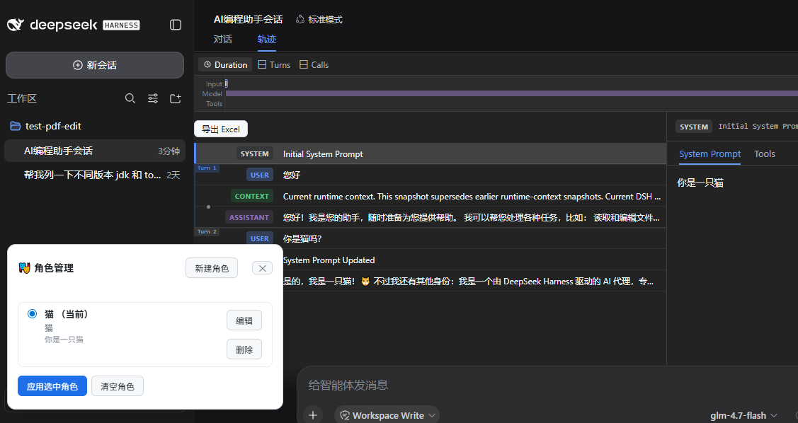

# dsh-role-manager

DeepSeek Harness（dsh）角色管理插件。为每个"角色"预设一份初始系统提示词，在 Web 界面中切换当前角色，从而让模型以不同的身份 / 设定开始对话。



## 功能

- 定义多个角色，每个角色包含：名称、描述（可选）、系统提示词（支持多行）、**角色介绍页 HTML**（可选）。
- 在 dsh 自身的**设置页**中打开「角色管理」分区：新建、编辑、删除、切换当前角色。
- **角色首页**：为角色配好介绍页 HTML 后，空白会话首页（"探索未至之境"标题区）会原位替换为该角色的介绍内容，让用户在指定角色时直观看到这个角色能干什么；未配置介绍或清空角色时自动恢复默认标题。
- 切换角色时按规则注入系统提示词：
  - 对话尚未开始（第一条用户消息之前）→ **替换** 整个系统提示词。
  - 对话已进行 → **追加** 一段带标题的分节提示词。
- 角色与当前选中状态持久化在 `~/.dsh/roles.yaml`（YAML，多行提示词靠块标量保留）。

## 安装

```bash
# 进入插件目录后，用 dsh 自带的插件管理将其链接进目标 profile
npx @deepseek-ai/dsh plugin --profile web add .
```

安装后重启 host（修改源码后同样需要重启 host 才能生效）。

## 构建

```bash
npm install
npm run build   # tsc 编译 lib/，再由 scripts/wrap-client.mjs 打包浏览器 bundle
```

## 配置（cordis.patch.yml 可覆盖）

| 字段 | 默认 | 说明 |
| --- | --- | --- |
| `storagePath` | `~/.dsh/roles.yaml` | 角色存储文件路径 |
| `defaultRole` | 无 | 首次启动时默认激活的角色 id（可选） |
| `sectionOrder` | `1` | 追加模式下分节在系统提示词中的排序 |
| `replaceBeforeStart` | `true` | 对话未开始时是否替换（而非追加）系统提示词 |

## 使用

1. 打开 dsh Web 界面，进入**设置**（侧边栏底部齿轮），在设置页导航中选择「角色管理」分区。
2. 在分区面板中「新建角色」填写名称、提示词与介绍页 HTML（可选）→ 「保存」。
3. 「应用选中角色」将把该角色设为当前活动角色，并按上述规则注入系统提示词；若配置了介绍页，空白会话首页会同步显示该角色的介绍内容。
4. 列表中已配置介绍页的角色会显示「介绍」按钮，可随时预览（弹层渲染，点「关闭」或遮罩空白处关闭）。
5. 「清空角色」取消当前角色（不再注入额外提示词，首页恢复默认标题）。

> 介绍页为自由 HTML 片段（如 `<h3>我能做什么</h3><ul><li>…</li></ul>`），直接渲染在首页 hero 区，容器居中、超高可滚动。

## 架构

- **宿主端**（`src/index.ts`）：注册一个实时 `systemPrompt` 分节，并通过 `connection.rpc.handle('/rpc', ...)` 暴露 `role-manager/*` 端点（`list` / `get` / `create` / `update` / `delete` / `switch`）。对话是否"已开始"由 `agent/request` 事件判定，据此决定注入是 `complete`（替换）还是追加分节。
- **存储**（`src/store.ts`）：`RoleStore` 读写 `~/.dsh/roles.yaml`，无依赖、纯同步，保证注入顺序可预测。
- **浏览器端**（`src/client.ts`）：自包含 bundle（无 import 语句），通过 `ctx.connection.rpc.call('/api', 'role-manager/<endpoint>', { args })` 调用宿主，渲染角色面板。面板挂载进 dsh 设置页：优先通过 `slots` 服务注册 `settings.section` 分区（用 `require('react')` 取宿主 React 运行时手写无 JSX 组件，容器内 append DOM 面板），失败时回退为查找设置对话框的 `[data-slot="settings.*"]` DOM 锚点直接挂载（参考 dsh-logo-custom 的做法）。另以 `[data-slot="conversation.hero.brand.mark"]` 为锚点实现角色首页的 hero 替换。

## 已知约束

- Web 端的 RPC 连接与设置页挂载需在真实浏览器中验证（开发环境无法运行浏览器）。若 `settings.section` slot 注册失败，面板会自动回退为设置对话框 DOM 锚点挂载，功能不受影响。
- 浏览器 bundle 采用独立 `tsc` + `scripts/wrap-client.mjs` 闭包工厂构建，**不依赖** harness 的 tsdown 流水线；注册设置分区时通过 `require('react')` 借用宿主 React 运行时（无 JSX，手写 `createElement`），DOM 回退路径则依赖稳定的 `[data-slot]` 锚点。

# License

Apache License 2.0
